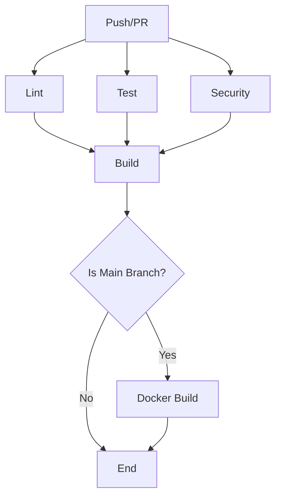

# GitHub Configuration

This directory contains GitHub-specific configuration files for CI/CD, code quality, and collaboration.

## 📁 Files Overview

### Workflows (`workflows/`)

#### `ci.yml` - Main CI/CD Pipeline
Runs on every push and pull request to `main` and `develop` branches.

**Jobs:**
1. **Lint** - Code quality checks using golangci-lint
2. **Test** - Unit and integration tests with PostgreSQL and Redis
3. **Security** - Security scanning with Gosec and Trivy
4. **Build** - Build application binary
5. **Docker** - Build Docker image (on push to main)

**Services:**
- PostgreSQL 15 (for integration tests)
- Redis 7 (for cache/session tests)

#### `codeql.yml` - Code Security Analysis
- Runs CodeQL analysis for security vulnerabilities
- Scheduled to run weekly on Mondays
- Also runs on push and pull requests

### Configuration Files

#### `CODEOWNERS`
Defines code ownership for automatic PR reviewer assignment.

#### `PULL_REQUEST_TEMPLATE.md`
Template for pull request descriptions ensuring consistency and completeness.

#### `dependabot.yml`
Automated dependency updates configuration:
- Go modules (weekly updates)
- GitHub Actions (weekly updates)
- Docker base images (weekly updates)

## 🔧 Setup Instructions

### 1. Required GitHub Secrets

Add these secrets to your GitHub repository:

```
Settings → Secrets and variables → Actions → New repository secret
```

**Required for Docker Hub (optional):**
- `DOCKER_USERNAME` - Docker Hub username
- `DOCKER_PASSWORD` - Docker Hub password or access token

**Required for Codecov (optional):**
- `CODECOV_TOKEN` - Codecov upload token

### 2. Enable GitHub Features

#### Enable Dependabot
1. Go to `Settings → Code security and analysis`
2. Enable `Dependabot alerts`
3. Enable `Dependabot security updates`
4. Enable `Dependabot version updates`

#### Enable CodeQL
1. Go to `Settings → Code security and analysis`
2. Enable `Code scanning`
3. Select `Set up with GitHub Advanced Security`

#### Enable Branch Protection
1. Go to `Settings → Branches`
2. Add rule for `main` branch:
   - ✅ Require pull request reviews before merging
   - ✅ Require status checks to pass before merging
   - ✅ Require branches to be up to date
   - ✅ Require conversation resolution before merging
   - Select required status checks:
     - `Lint`
     - `Test`
     - `Security`
     - `Build`

## 🚀 CI/CD Pipeline Flow



## 📊 Status Badges

Add these badges to your README.md:

```markdown


[](https://codecov.io/gh/username/repo)
```

## 🔍 Local Testing

### Run linter locally
```bash
# Install golangci-lint
go install github.com/golangci/golangci-lint/cmd/golangci-lint@latest

# Run linter
golangci-lint run
```

### Run security scanner locally
```bash
# Install gosec
go install github.com/securego/gosec/v2/cmd/gosec@latest

# Run security scan
gosec ./...
```

### Run tests locally
```bash
# Unit tests only
go test -short ./...

# All tests with coverage
go test -v -race -coverprofile=coverage.out ./...

# View coverage report
go tool cover -html=coverage.out
```

## 📈 Monitoring CI/CD

### View Workflow Runs
1. Go to `Actions` tab in GitHub
2. Select workflow name
3. View detailed logs and artifacts

### Download Build Artifacts
1. Go to workflow run
2. Scroll to `Artifacts` section
3. Download `api-binary`

## 🛠️ Troubleshooting

### Workflow Fails on Lint
- Check `.golangci.yml` configuration
- Run `golangci-lint run` locally
- Fix reported issues

### Workflow Fails on Test
- Check database connection settings
- Verify test environment variables
- Run tests locally with same env vars

### Workflow Fails on Security
- Review security scan results
- Update vulnerable dependencies
- Fix reported security issues

## 📚 Resources

- [GitHub Actions Documentation](https://docs.github.com/en/actions)
- [golangci-lint](https://golangci-lint.run/)
- [Gosec](https://github.com/securego/gosec)
- [Trivy](https://github.com/aquasecurity/trivy)
- [CodeQL](https://codeql.github.com/)
- [Dependabot](https://docs.github.com/en/code-security/dependabot)
