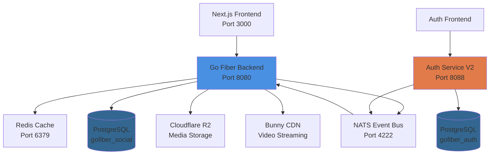
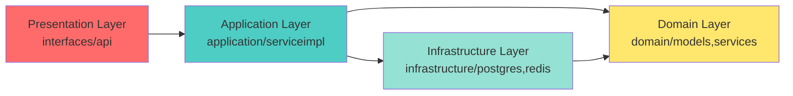
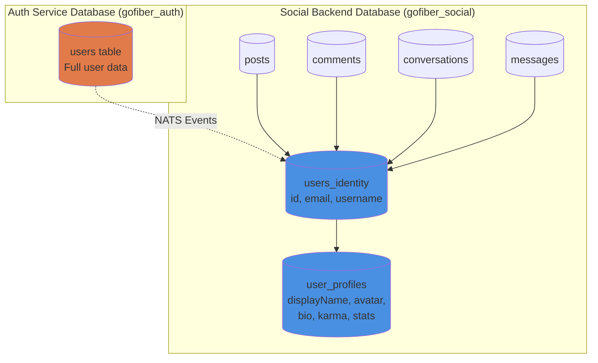
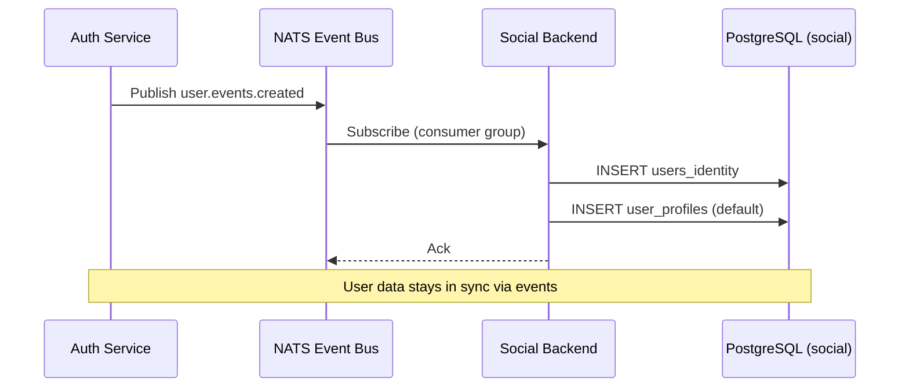
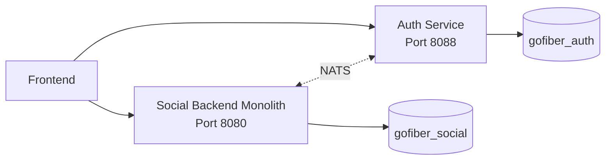
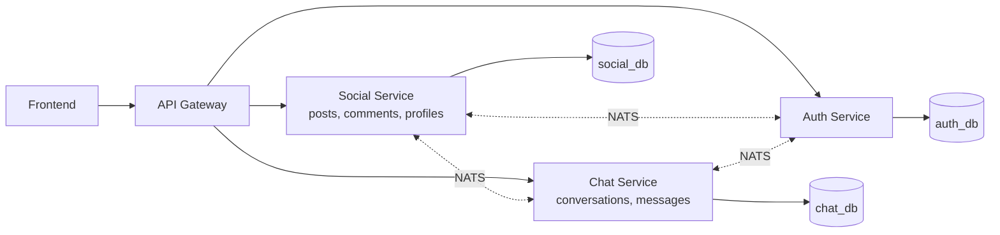
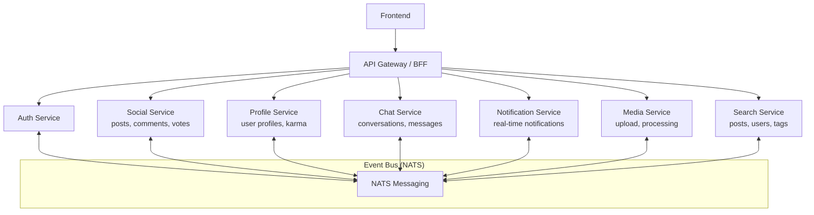
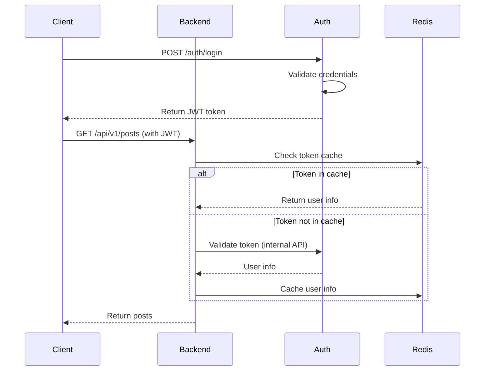

# SUEKK Backend - Project Architecture

> สถาปัตยกรรมของ Social Media Platform Backend (Monolith → Microservices Ready)

---

## 🏗️ High-Level Architecture Overview



---

## 📁 Project Structure (Clean Architecture)

```
gofiber-backend/
│
├─ cmd/                          # Application Entry Points
│  └─ api/
│     └─ main.go                 # Main application (Port 8080)
│
├─ domain/                       # 🎯 Business Logic Layer (Core Domain)
│  ├─ dto/                       # Data Transfer Objects
│  │  ├─ auth.go
│  │  ├─ user.go
│  │  ├─ post.go
│  │  └─ mappers.go              # Entity ↔ DTO conversions
│  │
│  ├─ events/                    # Domain Events (Event-Driven)
│  │  ├─ auth_events.go
│  │  └─ user_events.go
│  │
│  ├─ models/                    # Domain Entities (Database Models)
│  │  ├─ users_identity.go       # Auth identity (id, email, username)
│  │  ├─ user_profile.go         # Social profile (displayName, karma, bio)
│  │  ├─ post.go
│  │  ├─ comment.go
│  │  ├─ conversation.go
│  │  ├─ message.go
│  │  └─ ...
│  │
│  ├─ repositories/              # Repository Interfaces (Ports)
│  │  ├─ user_repository.go
│  │  ├─ post_repository.go
│  │  └─ ...
│  │
│  └─ services/                  # Service Interfaces (Ports)
│     ├─ user_profile_service.go
│     ├─ post_service.go
│     └─ ...
│
├─ application/                  # 🔧 Application Layer (Use Cases)
│  ├─ serviceimpl/               # Service Implementations
│  │  ├─ user_profile_service_impl.go
│  │  ├─ post_service_impl.go
│  │  ├─ conversation_service_impl.go
│  │  └─ ...
│  │
│  └─ eventhandlers/             # Event Handlers
│     └─ auth_service_v2_event_handler.go  # Listens to Auth Service events
│
├─ infrastructure/               # 🛠️ Infrastructure Layer (External Services)
│  ├─ postgres/                  # PostgreSQL Implementations
│  │  ├─ user_repository_impl.go
│  │  ├─ user_profile_repository_impl.go
│  │  ├─ post_repository_impl.go
│  │  ├─ conversation_repository_impl.go
│  │  └─ ...
│  │
│  ├─ redis/                     # Redis Cache
│  │  └─ redis_service.go
│  │
│  ├─ eventbus/                  # Event Bus (NATS)
│  │  └─ nats/
│  │     ├─ publisher.go
│  │     └─ subscriber.go
│  │
│  ├─ storage/                   # File Storage
│  │  ├─ r2_storage.go           # Cloudflare R2
│  │  ├─ bunny_storage.go        # Bunny CDN
│  │  └─ bunny_stream.go         # Video Streaming
│  │
│  ├─ websocket/                 # WebSocket Hubs
│  │  ├─ chat_hub.go
│  │  └─ notification_hub.go
│  │
│  └─ workers/                   # Background Workers
│     └─ video_encoder_worker.go
│
├─ interfaces/                   # 🌐 Presentation Layer (HTTP/WebSocket)
│  └─ api/
│     ├─ handlers/               # HTTP Handlers (Controllers)
│     │  ├─ user_profile_handler.go
│     │  ├─ post_handler.go
│     │  ├─ conversation_handler.go
│     │  ├─ internal_handler.go  # Internal APIs (webhooks)
│     │  └─ ...
│     │
│     ├─ routes/                 # Route Definitions
│     │  ├─ routes.go            # Main router
│     │  ├─ user_profile_routes.go
│     │  ├─ post_routes.go
│     │  ├─ internal_routes.go
│     │  └─ ...
│     │
│     └─ middleware/             # HTTP Middleware
│        ├─ auth.go              # JWT validation
│        ├─ cors.go
│        └─ ...
│
├─ pkg/                          # 📦 Shared Packages (Utilities)
│  ├─ config/                    # Configuration
│  ├─ database/                  # Database connection
│  ├─ di/                        # Dependency Injection
│  ├─ logger/                    # Logging
│  ├─ cache/                     # Cache utilities
│  ├─ auth_code_store/           # OAuth helpers
│  ├─ scheduler/                 # Cron jobs
│  ├─ ai/                        # AI integrations
│  └─ utils/                     # Common utilities
│
├─ migrations/                   # 🗄️ Database Migrations
│  ├─ 001_initial_schema.sql
│  ├─ 023_create_users_cache_table.sql
│  ├─ 024_drop_users_fk_constraints.sql
│  ├─ 025_add_displayname_avatar_to_user_profiles.sql
│  └─ ...
│
└─ scripts/                      # 🔧 Utility Scripts
   ├─ fix_duplicate_conversations.go
   ├─ sync_users_initial.go
   └─ ...
```

---

## 🎯 Architecture Layers (Clean Architecture)



### Layer Responsibilities:

1. **Presentation Layer** (`interfaces/`)
   - HTTP Handlers (Controllers)
   - Route definitions
   - Request/Response DTOs
   - Middleware (auth, CORS, etc.)

2. **Application Layer** (`application/`)
   - Service implementations (business logic)
   - Event handlers
   - Use case orchestration

3. **Domain Layer** (`domain/`)
   - Core business entities (models)
   - Business rules
   - Repository/Service interfaces (ports)

4. **Infrastructure Layer** (`infrastructure/`)
   - Database implementations
   - External service integrations
   - Event bus, cache, storage

---

## 🗄️ Database Architecture

### Current Setup: Dual Database (V2 Architecture)



### Table Relationships:

**users_identity** (Identity data synced from Auth Service)
- ✅ Contains: `id`, `email`, `username`, `created_at`, `synced_at`
- ❌ Does NOT contain: `password`, `role`, `displayName`, `avatar`

**user_profiles** (Social-specific data)
- ✅ Contains: `displayName`, `avatar`, `bio`, `karma`, `followers_count`, `following_count`
- 🔗 Foreign Key: `user_id` → `users_identity.id`

**Other tables** reference `users_identity.id` for user relationships

---

## 🔄 Event-Driven Architecture (NATS)



### Event Flow:

1. **Auth Service** publishes events:
   - `user.events.created` - New user registered
   - `user.events.updated` - User info updated
   - `user.events.deleted` - User deleted

2. **Social Backend** listens via NATS:
   - Consumer Group: `social-backend-consumer`
   - Subject: `user.events.*`
   - Handler: `auth_service_v2_event_handler.go`

3. **Data Sync**:
   - Creates/updates `users_identity` record
   - Creates default `user_profiles` if new user

---

## 🚀 Current Services & Features

### Core Features:
- ✅ **User Management** (via Auth Service V2 events)
- ✅ **User Profiles** (displayName, avatar, bio, karma)
- ✅ **Posts** (with media, tags, votes)
- ✅ **Comments** (nested, with votes)
- ✅ **Real-time Chat** (WebSocket, conversations, messages)
- ✅ **Notifications** (WebSocket, real-time)
- ✅ **Follow System** (followers, following)
- ✅ **Search** (posts, users, tags)
- ✅ **Media Upload** (Cloudflare R2, Bunny CDN)
- ✅ **Video Streaming** (Bunny Stream)
- ✅ **Auto-post System** (AI-generated posts, scheduled)

### External Integrations:
- **Redis** - Caching, feed cache
- **Cloudflare R2** - Image/file storage
- **Bunny CDN** - Video streaming
- **NATS** - Event bus (Auth Service ↔ Backend)
- **OpenAI** - AI post generation

---

## 🔮 Microservice Migration Plan

### Phase 1: Current State (Monolith with Separate Auth)


### Phase 2: Extract Chat Service (Next Step)


### Phase 3: Full Microservices


---

## 📊 Service Boundaries (Suggested)

### 1. **Auth Service** (Already Separated ✅)
- User registration, login
- JWT token management
- Password management
- **DB**: `gofiber_auth` (users, sessions)

### 2. **Social Service** (Core Social Features)
- Posts, Comments, Votes
- Tags, Saved Posts
- **DB**: Posts, Comments, Votes, Tags

### 3. **Profile Service**
- User profiles (displayName, avatar, bio)
- User stats (karma, followers count)
- Follow relationships
- **DB**: users_identity, user_profiles, follows

### 4. **Chat Service**
- 1-on-1 conversations
- Real-time messaging (WebSocket)
- **DB**: conversations, messages

### 5. **Notification Service**
- Real-time notifications (WebSocket)
- Notification preferences
- **DB**: notifications, notification_settings

### 6. **Media Service**
- File uploads (images, videos)
- Media processing (resize, encode)
- CDN integration
- **DB**: media, files

### 7. **Search Service** (Future)
- Full-text search (Elasticsearch/Meilisearch)
- Search indexing
- Search analytics

---

## 🎯 Migration Strategy

### Prerequisites for Microservice Split:

1. ✅ **Event-Driven Communication** (NATS) - Already implemented
2. ✅ **Separate Databases** - Auth already separated
3. ⚠️ **API Gateway** - Not yet (currently direct calls)
4. ⚠️ **Service Discovery** - Not yet
5. ⚠️ **Distributed Tracing** - Not yet

### Recommended Next Steps:

1. **Extract Chat Service** (Easiest first)
   - Already has clear boundaries (conversations, messages)
   - Minimal coupling with other features
   - Can communicate via NATS events

2. **Add API Gateway** (Kong, Traefik, or custom)
   - Centralized routing
   - Authentication/Authorization
   - Rate limiting

3. **Split Profile Service**
   - Separate user profile management
   - Follow system
   - Karma/stats calculation

4. **Extract Notification Service**
   - Real-time notifications via WebSocket
   - Push notifications

5. **Media Service**
   - Upload handling
   - Media processing
   - CDN integration

---

## 🔐 Current Authentication Flow



---

## 📈 Performance Optimizations

### Current Optimizations:
- ✅ **Redis Caching** - Token validation, feed cache
- ✅ **Database Indexes** - Optimized queries
- ✅ **Cursor Pagination** - Efficient data loading
- ✅ **CDN** - Static file serving (R2, Bunny)
- ✅ **Connection Pooling** - Database connections
- ✅ **GORM Preloading** - Reduce N+1 queries

### Recommended Improvements:
- ⚠️ Add **Read Replicas** for database
- ⚠️ Implement **CQRS** pattern (read/write separation)
- ⚠️ Add **Message Queue** for async tasks
- ⚠️ Implement **Circuit Breaker** pattern

---

## 🏁 Summary

### Current State:
- ✅ **Clean Architecture** (Domain → Application → Infrastructure)
- ✅ **Event-Driven** (NATS for Auth Service communication)
- ✅ **Separated Auth** (Microservice ready)
- ✅ **Dual Database** (Auth + Social)
- ⚠️ **Monolith** (Social features in one service)

### Strengths:
- Clear separation of concerns
- Easy to test (dependency injection)
- Event-driven foundation for microservices
- Scalable data model

### Next Steps for Microservices:
1. Extract Chat Service
2. Add API Gateway
3. Implement service discovery
4. Add distributed tracing
5. Split remaining services gradually

---

**Last Updated**: 2025-11-24
**Author**: Generated by Claude Code
**Project**: SUEKK Social Media Platform
